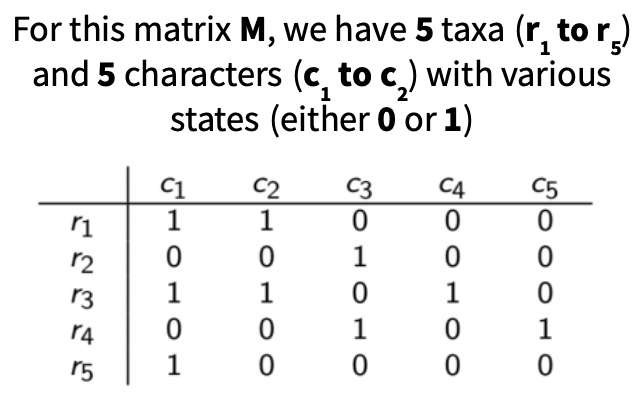
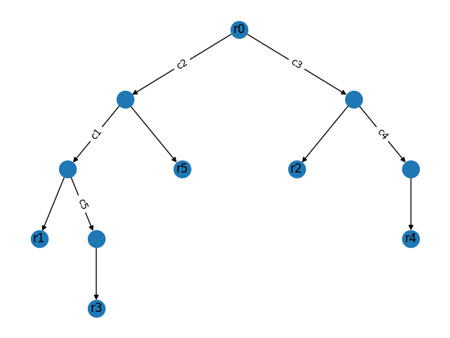
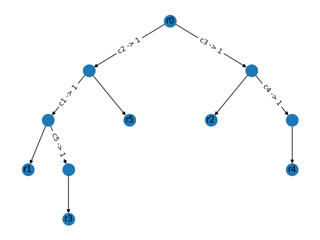
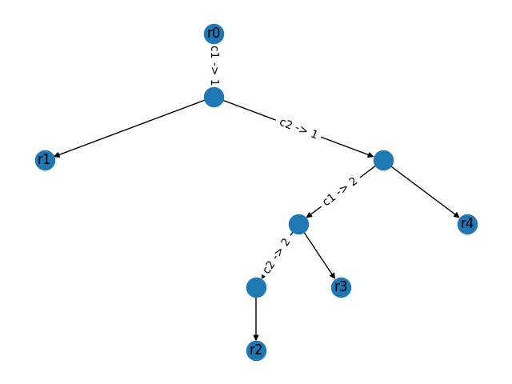

# Three-State Phylogeny

This is an implementation of an algorithm to solve the 3-state perfect phylogeny problem. In the perfect phylogeny problem, an `n` by `m` matrix, called `M`, with `n` taxa and `m` characters is inputted. The rules in order to verify that the tree exists and the tree is a perfect phylogeny are if `M` has state `s` at taxon `f` and character `c`, then `f` has the state `s` for character `c`. Additionally, every taxon labels one leaf and, starting from the root, every state shift on the edges leads to the taxon with those exact state shifts. The goal is to find a tree such that every edge represents a single character state change and every state change represents a single edge. Specifically, in the two state phylogeny, the input is a matrix with various state changes of either 0 or 1. As shown in the figure below this matrix has 5 taxa (`r1` to `r5`) and 5 characters (`c1` to `c5`):


Figure 1: Matrix M for Two State Perfect Phylogeny

In order to create this tree, each row of matrix `M` is iteratively considered choosing a root node, and a starting node, where each of the subtrees is built out from the root to the last matching characters. In the figure below, the final tree for this matrix is shown where each edge `c_i` represents `c_i` changing from 0 to 1, which for each edge occurs only once in the whole tree. This tree will be considered a perfect phylogeny if all the rules, as discussed above, have been met. This algorithm can be solved in polynomial time.


## Running

Clone this repository with `git clone https://github.com/nakuliyer/Multistate-Phylogeny.git` and open this directory in command line.

This project uses the libraries `NumPy` and `NetworkX`. The easiest way access these dependencies is with a virtual environment; this can be started on a Mac with:
1. `virtualenv env` (create the virtual environment)
2. `source env/bin/activate` (active it)
3. `pip install -r requirements.txt` (download all requirements/dependencies for this project)

Finally, we can run the `main.py` file. It takes the following args:
* `-f [filename]` to run the algorithm for a matrix in a file (see below)
* `-a` to run all the matrices in `sample_two_state_runs/` and `sample_three_state_runs/`
* `-d` to draw the perfect phylogeny tree for those matrices that have such a tree. `False` by default.
* `-n 2` for two-state perfect phylogeny and `-n 3` for three-state. `-n 3` is assumed by default

Note that exactly one of `-f` and `-a` must be supplied. For matrices run from a file, the matrix must be readable by [np.loadtxt](https://numpy.org/doc/stable/reference/generated/numpy.loadtxt.html) (See `sample_three_state_runs/` for examples).

`python main.py -a` should print:
```
Matrix "sample_two_state_runs/m1.txt" does not have a perfect phylogeny
Matrix "sample_two_state_runs/m0.txt" has a perfect phylogeny
Matrix "sample_three_state_runs/m2.txt" has a perfect phylogeny
Matrix "sample_three_state_runs/m1.txt" has a perfect phylogeny
Matrix "sample_three_state_runs/m0.txt" has a perfect phylogeny
```
`sample_two_state_runs/m1.txt` has an obvious conflict, while the other basic matrices are conflict-free.

`python main.py -a -d` should do the exact same, but also draw the following graphs:






## Testing

First, run all the commands in the "Running" section to set up a virtual environment. Then, `python testing.py` will run the provided test file to randomly generate perfect and potentially imperfect trees.
